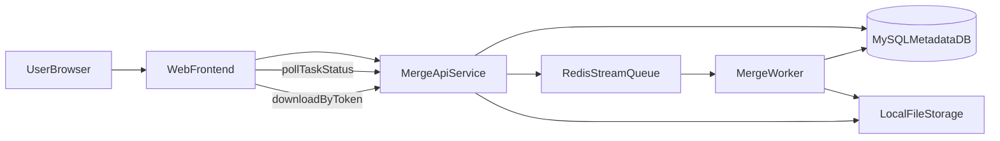
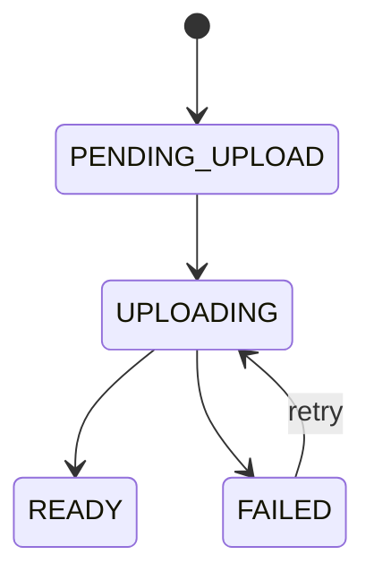
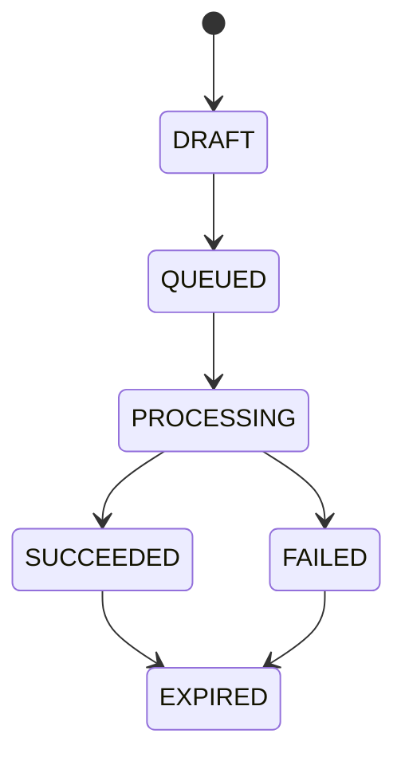

# PDF 合并 MVP 技术架构设计（Java 实施版）

## 1. 文档信息

| 项目 | 说明 |
|------|------|
| 文档类型 | 技术架构设计 |
| 对应 PRD | [PDF合并-MVP.md](../01-产品/需求文档/PDF合并-MVP.md) |
| 版本 | v1.1 |
| 创建日期 | 2026-03-24 |
| 维护角色 | 前端 / 后端 / 平台 / QA |

---

## 2. 目标与边界

### 2.1 目标

- 支持用户一次上传多份 PDF，按列表顺序整文件合并为单个 PDF 下载。
- 在弱网和中等并发场景下，保持可感知进度和可重试失败处理。
- 通过异步队列隔离请求峰值，保证 API 可用性与任务吞吐稳定。

### 2.2 MVP 范围（来自 PRD）

- 包含：多文件上传、排序、整文件合并、下载、基础校验、进度反馈、匿名可用。
- 不包含：单文件内选页、书签处理、统一尺寸、OCR/互转、历史任务页（可后续扩展）。

### 2.3 冻结决策

- 加密 PDF：策略 A（不支持，服务端识别后失败）。
- 处理模式：异步队列（Redis Stream，创建任务 -> 入队 -> Worker 合并 -> 结果下载）。
- 限额参数：`N_files`、`S_single`、`S_total` 保留占位符，由主规则表统一赋值。
- 技术栈：`Spring Boot 4.0.4`、`MySQL`、`Redis Stream`、本地文件存储（单机）。

### 2.4 Java 技术栈选型

- 运行框架：`Spring Boot 4.0.4`（API 与 Worker 分离部署）。
- 数据库：`MySQL 8.0+`（InnoDB，`utf8mb4`）。
- 异步任务：`Redis Stream` + Consumer Group。
- 文件存储：本地文件系统（全环境统一，当前限定单机部署）。
- PDF 引擎：`Apache PDFBox`（MVP 阶段）。

---

## 3. 总体架构

### 3.1 组件职责

- `WebFrontend`
  - 文件选择/拖拽、排序、上传进度展示、任务提交、状态轮询、失败重试。
- `MergeApiService`
  - 参数校验、鉴权/匿名会话识别、任务编排、下载 token 签发、错误码统一。
- `RedisStreamQueue`
  - 异步解耦 API 与合并计算，基于 Consumer Group 消费，支持重试与死信转移。
- `LocalFileStorage`
  - 存放原始 PDF 与合并结果，按任务目录隔离，支持定时 TTL 清理。
- `MergeWorker`
  - 拉取任务、读取输入文件、执行 PDF 合并、结果文件落盘、状态回写。
- `MySQLMetadataDB`
  - 保存任务、文件项、状态、错误信息、进度快照、审计字段。

---

## 4. 端到端流程

### 4.1 上传阶段

1. 前端本地校验扩展名和基础约束（至少 2 个、`S_single`、`N_files`）。
2. 前端调用上传初始化接口，服务端下发每个文件 `uploadToken` 与本地文件标识。
3. 前端并发上传（建议并发 3），逐行更新进度。
4. 服务端在“确认上传”环节做强校验：
   - MIME + magic bytes
   - 单文件大小
   - PDF 可读取性（含加密识别）
5. 校验通过标记文件状态为 `READY`，否则为 `FAILED` 并附错误码。

### 4.2 合并阶段

1. 前端提交合并任务（携带文件顺序列表）。
2. 服务端再次校验总数、总大小与文件归属后创建任务，状态置为 `QUEUED`。
3. Worker 消费任务后置为 `PROCESSING`，按顺序拼接所有页。
4. 成功后上传结果文件并置为 `SUCCEEDED`；失败置为 `FAILED` 并写明可展示原因。

### 4.3 下载阶段

1. 前端轮询任务状态至 `SUCCEEDED`。
2. 前端请求下载 token，服务端校验任务归属后签发短时 `downloadToken`。
3. 用户下载结果文件；埋点 `merge_download`。

---

## 5. 数据模型设计

### 5.1 merge_task

- `task_id`：任务 ID（UUID）
- `owner_type`：`ANON` / `USER`
- `owner_id`：匿名 token 或用户 ID
- `status`：`DRAFT` / `QUEUED` / `PROCESSING` / `SUCCEEDED` / `FAILED` / `EXPIRED`
- `file_count`：输入文件数量
- `total_size_bytes`：输入总大小
- `result_file_path`：结果文件相对路径（成功后写入）
- `error_code` / `error_message`：失败信息
- `created_at` / `updated_at` / `expired_at`

### 5.2 merge_task_file

- `id`
- `task_id`
- `order_index`：合并顺序（从 1 开始）
- `origin_file_name`
- `local_file_path`
- `size_bytes`
- `status`：`PENDING_UPLOAD` / `UPLOADING` / `READY` / `FAILED`
- `error_code` / `error_message`

### 5.3 设计约束

- `task_id + order_index` 唯一，防止顺序污染。
- 状态更新使用乐观锁版本号，避免并发覆盖。
- 所有文件路径按租户与日期分层，例如：`merge/{ownerId}/{taskId}/inputs/*`。
- 表与索引建议（MySQL）：
  - `merge_task(task_id)` 主键；`idx_owner_status(owner_id, status, created_at)`。
  - `merge_task_file(task_id, order_index)` 唯一索引；`idx_task_status(task_id, status)`。
  - 字符集统一 `utf8mb4`，时间字段统一 `timestamp(3)`。

---

## 6. 接口契约（MVP）

### 6.1 初始化上传

- `POST /接口/v1/pdf/merge/uploads:init`
- 请求：
  - `files[]`: `name`, `size`, `sha256`(可选)
- 响应：
  - `uploadItems[]`: `fileId`, `localFileName`, `uploadToken`
  - `limits`: `N_files`, `S_single`, `S_total`

### 6.2 确认上传

- `POST /接口/v1/pdf/merge/uploads:complete`
- 请求：
  - `fileId`, `uploadToken`
- 响应：
  - `status`: `READY` / `FAILED`
  - `errorCode`（失败时）

### 6.3 创建合并任务

- `POST /接口/v1/pdf/merge/tasks`
- 请求：
  - `files[]`: `fileId`, `orderIndex`
- 响应：
  - `taskId`
  - `status`: `QUEUED`

### 6.4 查询任务状态

- `GET /接口/v1/pdf/merge/tasks/{taskId}`
- 响应：
  - `status`
  - `progress`: `stage`, `current`, `total`（可选）
  - `errorCode` / `errorMessage`
  - `result`: `fileName`, `sizeBytes`（成功时）

### 6.5 获取下载 token

- `POST /接口/v1/pdf/merge/tasks/{taskId}/download-token`
- 响应：
  - `downloadToken`
  - `expireAt`

### 6.6 下载文件

- `GET /接口/v1/pdf/merge/tasks/{taskId}/download?token={downloadToken}`
- 响应：
  - `application/pdf` 文件流
  - `Content-Disposition: attachment; filename=merged.pdf`

---

## 7. 状态机与进度映射

### 7.1 文件状态机

### 7.2 任务状态机

### 7.3 前端进度展示规则

- `QUEUED`：显示排队文案（可带队列估算）。
- `PROCESSING`：显示“正在合并第 i/n 个文件”或不确定进度条。
- `FAILED`：展示可执行建议 + 错误码。
- `SUCCEEDED`：展示文件大小、默认名 `merged.pdf`、下载 CTA。

---

## 8. 错误码与用户文案映射

| 错误码 | 场景 | 用户提示（摘要） | 重试策略 |
|------|------|------------------|---------|
| `MERGE_400_PDF_INVALID` | 非 PDF / 伪 PDF | 仅支持 PDF | 更换文件 |
| `MERGE_400_FILE_TOO_LARGE` | 超过 `S_single` | 单文件过大 | 压缩或分批 |
| `MERGE_400_TOO_MANY_FILES` | 超过 `N_files` | 文件数量超限 | 减少文件 |
| `MERGE_400_TOTAL_TOO_LARGE` | 超过 `S_total` | 总大小超限 | 减少或拆分 |
| `MERGE_400_ENCRYPTED_UNSUPPORTED` | 加密文件（策略A） | 暂不支持加密 PDF | 本地解密后重试 |
| `MERGE_422_PDF_CORRUPTED` | 损坏/无法读取 | 文件损坏或不可读 | 更换文件 |
| `MERGE_503_ENGINE_FAILED` | 合并引擎异常 | 合并失败，请稍后重试 | 允许整任务重试 |
| `MERGE_504_TIMEOUT` | 处理超时 | 处理时间较长 | 建议稍后重试 |
| `MERGE_599_NETWORK` | 上传中断 | 网络中断 | 单文件重传 |

---

## 9. 安全与风控

- 文件安全
  - 服务端必须基于 magic bytes 校验真实类型，不信任扩展名。
  - Worker 运行在隔离进程，限制 CPU/内存/执行时长，防止畸形文件拖垮实例。
- 访问控制
  - 匿名场景绑定 `anon_token` + 会话；登录场景绑定 `user_id`。
  - 下载 token 按任务归属签发，短时有效（建议 15 分钟）。
- 滥用防护
  - 接口限流（IP + token + user 组合维度）。
  - 队列消费限速，防止热用户长期占满。
- 数据生命周期
  - 输入文件 TTL 建议 24h，结果文件 TTL 建议 24h。
  - 元数据可保留 7~30 天用于审计与问题定位。

### 9.1 本地存储运维规范（单机）

- 目录规范
  - 根目录：`/data/pdf-merge/`
  - 输入目录：`/data/pdf-merge/{yyyyMMdd}/{taskId}/inputs/`
  - 输出目录：`/data/pdf-merge/{yyyyMMdd}/{taskId}/outputs/`
- 权限与隔离
  - 应用运行用户仅授予根目录读写权限，禁止访问系统其它路径。
  - 文件名统一由服务端生成 UUID，避免路径穿越。
- 清理策略
  - 定时任务每小时扫描一次过期目录（按 `expired_at` 与 TTL 删除）。
  - 删除顺序：先删文件再删空目录，失败写入补偿队列重试。
- 容量告警
  - 磁盘使用率 `> 80%` 告警，`> 90%` 触发保护策略（拒绝新任务）。
  - 监控 inode 使用率，避免“小文件爆满”。
- 备份恢复
  - MySQL 每日全量 + binlog 增量；文件目录每日快照。
  - 故障恢复时以 MySQL 任务状态为准，重建文件索引一致性。

---

## 10. 性能与容量基线

- 目标（初始）
  - 成功率：>= 98%（排除用户主动取消）。
  - 时延：普通文档处理 P95 <= 60s（后续根据真实流量收紧）。
- 容量参数（可配置）
  - 前端上传并发：默认 3。
  - Worker 并发：按 CPU 与平均页数压测后配置（单机建议 2~4）。
  - Redis Stream 消费重试：最多 2 次，指数退避；超限转死信 Stream。
- 瓶颈关注点
  - 大文件 I/O 与本地磁盘吞吐。
  - 单任务页数过高导致长尾。
  - 热点时段 Redis Stream 积压。

---

## 11. 可观测性与告警

### 11.1 日志字段

- `trace_id`, `task_id`, `owner_id`, `status_from`, `status_to`, `error_code`, `latency_ms`

### 11.2 指标

- API：QPS、错误率、P95 延迟
- 上传：成功率、单文件平均时长
- 任务：排队时长、处理时长、成功率、失败分布
- 下载：token 签发成功率、下载触发率
- 存储：磁盘使用率、inode 使用率、清理任务成功率

### 11.3 告警建议

- `merge_success_rate` 连续 5 分钟低于阈值。
- `queue_lag_seconds` 高于阈值并持续增长。
- `MERGE_503_ENGINE_FAILED` 激增。
- 磁盘使用率超过阈值并持续 5 分钟。

---

## 12. 测试与验收策略

### 12.1 功能测试

- 最小 2 文件、最大 `N_files`、边界 `S_single` / `S_total`。
- 排序后合并顺序正确（使用带页码样本验证）。
- 删除/新增后任务提交与结果一致。

### 12.2 异常测试

- 非 PDF、伪 PDF、损坏文件、加密文件（策略 A）。
- 上传中断重传、任务超时、Worker 异常退出。
- 重复提交防抖与幂等校验。

### 12.3 兼容测试

- 输出在 Adobe、Chrome 内置阅读器、至少一款国产阅读器可打开。

---

## 13. 埋点方案（与 PRD 对齐）

- `merge_enter`
- `merge_file_add`（含成功/失败原因）
- `merge_order_change`
- `merge_submit`
- `merge_success`
- `merge_fail`（带 `error_code`）
- `merge_download`

---

## 14. 实施拆解建议

- 前端
  - 上传队列、列表状态机、轮询器、错误提示映射、无障碍排序备选交互。
- 后端 API
  - 上传初始化/确认、任务创建、状态查询、下载 token 与文件流、限流和鉴权。
- Worker
  - Redis Stream 消费、合并引擎封装、失败重试、超时控制、结果回写。
- 平台运维
  - Redis/MySQL/本地存储配置、监控仪表盘、告警阈值与备份策略。
- QA
  - 构建边界样本库、异常注入脚本、回归清单自动化。

---

## 15. 风险与后续演进

- 风险
  - 合并引擎在复杂 PDF 上可能出现兼容性问题。
  - 匿名会话在刷新/跨设备场景不可恢复，可能引发用户疑惑。
- 演进方向
  - 支持加密 PDF（策略 B）与逐文件密码输入。
  - 支持历史任务页与异步通知（邮件/站内）。
  - 增加页级进度与断点续传能力。
  - 多节点扩容时迁移到共享对象存储（MinIO/S3/NAS）并将下载 token 网关化。

---

## 16. Java 开工交付包

以下资产可直接作为研发开工输入：

- 模块拆分与任务分解：
  - [PDF合并-模块拆分.md](../04-后端/服务/PDF合并-模块拆分.md)
- Redis Stream 消费组/死信/恢复设计：
  - [PDF合并-RedisStream设计.md](../04-后端/服务/PDF合并-RedisStream设计.md)
- MySQL DDL（可执行）：
  - [PDF合并-MySQL-DDL.sql](../04-后端/数据库/PDF合并-MySQL-DDL.sql)
- API 契约（MVP）：
  - [PDF合并-MVP-接口(Java).md](../04-后端/接口/PDF合并-MVP-接口(Java).md)
- Spring Boot 4.0.4 配置模板：
  - [PDF合并-应用配置模板.yml](../04-后端/部署/PDF合并-应用配置模板.yml)
- Spring Boot 启动骨架（模块/POM/类签名）：
  - [PDF合并-SpringBoot启动骨架.md](../04-后端/服务/PDF合并-SpringBoot启动骨架.md)
- Maven POM 完整模板（父/子模块）：
  - [PDF合并-Maven依赖清单.md](../04-后端/服务/PDF合并-Maven依赖清单.md)
- Java 核心类骨架（API/Worker/Stream）：
  - [PDF合并-Java代码骨架.md](../04-后端/服务/PDF合并-Java代码骨架.md)
- 前端实施文档（Next.js 14）：
  - [PDF合并-前端实现方案.md](../03-前端/PDF合并-前端实现方案.md)
- 前端代码骨架（页面/Store/API/Hook）：
  - [PDF合并-前端代码骨架.md](../03-前端/PDF合并-前端代码骨架.md)
- 前端联调清单（接口与埋点）：
  - [PDF合并-前端联调清单.md](../03-前端/PDF合并-前端联调清单.md)
- 前端测试用例清单（功能/异常/回归）：
  - [PDF合并-前端测试用例.md](../03-前端/PDF合并-前端测试用例.md)
