# PDF 合并 MVP 前端实施文档（Next.js 14）

## 1. 目标与范围

- 面向 `PDF 合并 MVP` 页面，提供可直接开工的前端技术设计。
- 对齐后端契约：`uploadToken`、`downloadToken`、任务状态轮询。
- 聚焦 Web 端，不覆盖小程序/管理后台。

## 2. 技术栈冻结

| 层级 | 选型 | 说明 |
|------|------|------|
| 框架 | Next.js 14 + React 18 + TypeScript | App Router，SSR/CSR 混合 |
| UI | Ant Design 5 | 上传、按钮、消息提示、进度组件 |
| 状态管理 | Zustand | 页面级状态机与列表状态 |
| 请求层 | Axios | 统一拦截器、超时与错误处理 |
| 服务器状态 | TanStack Query | 任务轮询、缓存、重试 |
| 拖拽排序 | dnd-kit | 文件列表排序 |

## 3. 目录结构

```text
src/
  app/
    merge/
      page.tsx
  features/
    pdf-merge/
      api/
        mergeApi.ts
      components/
        UploadDropzone.tsx
        FileListSortable.tsx
        MergeProgress.tsx
        MergeResultPanel.tsx
      hooks/
        useMergePolling.ts
      store/
        useMergeStore.ts
      types/
        merge.types.ts
      utils/
        errorCodeMap.ts
        analytics.ts
```

## 4. 状态机设计

### 4.1 文件状态

- `PENDING_UPLOAD`
- `UPLOADING`
- `READY`
- `FAILED`

### 4.2 任务状态

- `IDLE`（前端本地态）
- `QUEUED`
- `PROCESSING`
- `SUCCEEDED`
- `FAILED`

### 4.3 页面状态映射

- 空状态：`READY` 文件数 `< 2`
- 可提交：`READY` 文件数 `>= 2` 且无 `UPLOADING`
- 合并中：任务状态 `QUEUED/PROCESSING`
- 成功态：任务状态 `SUCCEEDED`
- 失败态：任务状态 `FAILED`（展示错误码与建议）

## 5. API 对接映射

Base URL：`/接口/v1/pdf/merge`

| 功能 | 方法 | 路径 |
|------|------|------|
| 上传初始化 | POST | `/uploads:init` |
| 上传确认 | POST | `/uploads:complete` |
| 创建任务 | POST | `/tasks` |
| 查询任务 | GET | `/tasks/{taskId}` |
| 获取下载 token | POST | `/tasks/{taskId}/download-token` |
| 下载结果 | GET | `/tasks/{taskId}/download?token=...` |

## 6. 关键交互流程

```mermaid
flowchart LR
  enter[EnterMergePage] --> add[AddFiles]
  add --> init[uploadsInit]
  init --> upload[UploadFiles]
  upload --> complete[uploadsComplete]
  complete --> reorder[ReorderList]
  reorder --> create[createTask]
  create --> poll[PollingTaskStatus]
  poll --> success[GetDownloadToken]
  success --> download[DownloadMergedPdf]
```



## 7. 错误码前端映射策略

与后端错误码一一对应，统一走 `errorCodeMap`：

- `MERGE_400_PDF_INVALID` -> “仅支持 PDF 文件”
- `MERGE_400_FILE_TOO_LARGE` -> “单文件超过上限”
- `MERGE_400_TOO_MANY_FILES` -> “文件数量超过上限”
- `MERGE_400_TOTAL_TOO_LARGE` -> “总大小超过上限”
- `MERGE_400_ENCRYPTED_UNSUPPORTED` -> “暂不支持加密 PDF”
- `MERGE_422_PDF_CORRUPTED` -> “文件损坏或不可读取”
- `MERGE_503_ENGINE_FAILED` -> “合并失败，请稍后重试”
- `MERGE_504_TIMEOUT` -> “处理超时，请稍后重试”
- `MERGE_599_NETWORK` -> “网络异常，请检查连接后重试”

## 8. 轮询策略

- 轮询接口：`GET /tasks/{taskId}`
- 初始间隔：`1500ms`
- 退避：最多递增到 `5000ms`
- 停止条件：`SUCCEEDED` / `FAILED`
- 超时保护：总轮询时长超过 `120s` 显示超时提示

## 9. 埋点策略（与 PRD 对齐）

- `merge_enter`
- `merge_file_add`
- `merge_order_change`
- `merge_submit`
- `merge_success`
- `merge_fail`
- `merge_download`

每个事件至少上报：`trace_id`、`task_id`（如有）、`error_code`（失败时）。

## 10. 开工顺序建议

1. 定义 `types` 与 `store`。
2. 接入 `mergeApi.ts` 与 Axios 拦截器。
3. 完成上传/排序组件联调。
4. 完成创建任务与轮询 Hook。
5. 完成下载与错误提示映射。
6. 接入埋点并补测试用例。
